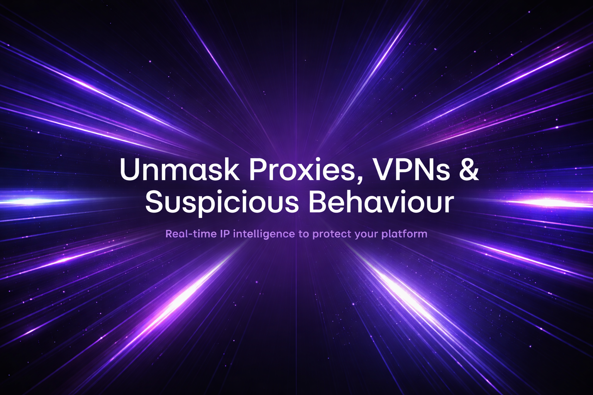

# ping0.xyz Context API



## Overview
The **ping0.xyz Context API** is a powerful tool for unmasking hidden users and scoring session risk. It returns a deeply enriched JSON object containing over 50 data points regarding a specific IP address, including detection for VPNs, proxies, and behavioral anomalies.

[**Visit Main Website**](https://ping0.xyz)

## Key Features
- **Risk Scoring**: Unified 0-100 score indicating session risk.
- **Infrastructure Detection**: Identify Datacenters, Residential, Mobile, and Satellite connections.
- **Privacy Detection**: Detect Tor, VPNs, and Proxies (over 3,000 providers tracked).
- **ASN & Company**: Detailed ownership and ISP information.
- **Location**: Geolocation down to the city level.

## Example Response

```json
{
  "ip": "50.114.34.126",
  "risk_score": 100,
  "is_abuser": true,
  "is_proxy": true,
  "is_datacenter": true,
  "infrastructure": [
    "Residential",
    "Datacenter"
  ],
  "proxies": [
    "PACKETSTREAM_PROXY",
    "DATABAY_PROXY"
  ],
  "asn": {
    "asn": 395898,
    "org": "TND, LLC",
    "type": "business"
  },
  "company": {
    "name": "Private Customer",
    "domain": "abuseradar.com"
  },
  "location": {
    "city": "Sheridan",
    "country": "US",
    "state": "Wyoming"
  }
}
```

## Get Started
Integrate this API into your security stack to prevent fraud and validate user identity in real-time.

[**Get API Access**](https://ping0.xyz)
